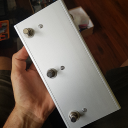

# BB15_Footswitch
 

A MIDI project using the Arduino, that sends Program Change commands. It was created to control a [Fender Bassbreaker 15](https://shop.fender.com/en-FR/guitar-amplifiers/vintage-pro-tube/bassbreaker-15-head/2263006000.html) guitar tube amplifier head, which has been modded with MIDI control and 3 more or less independent channels.

The footswitches between the LOW/MID/HIGH modes on the modded amp.

This code is released under the [gpl-3.0](https://choosealicense.com/licenses/gpl-3.0/) license, which means you can freely use it but must make available the complete source code with your modifications.

# ToDo's
– Add more images

– Draw schematic

– Add dependency management
